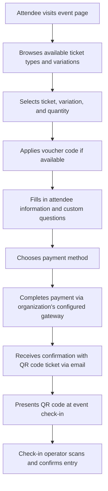
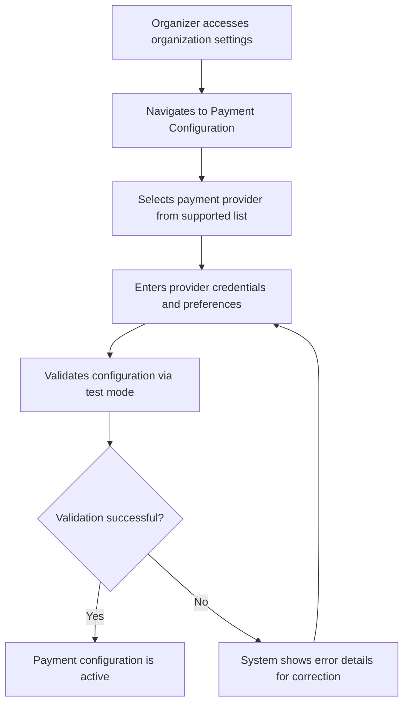

# Ingressos Platform Migration to Elixir Phoenix

## 1. Executive Summary

**TL;DR:** Rebuild the Ingressos event ticketing platform from a Django/Python fork of Pretix to a native Elixir Phoenix application with full feature parity, plus a new "Bring Your Own Gateway" (BYOG) model that lets each organization configure their own payment provider.

**Value Proposition:** The current platform is a fork of Pretix that is costly to maintain and extend. Migrating to Elixir Phoenix gives the Devs Norte community full ownership of a platform with real-time capabilities (LiveView), fault-tolerant background processing (OTP), and better concurrency on the same infrastructure — while preserving every feature organizers and attendees rely on today. The BYOG payment model replaces the rigid plugin-based approach and empowers each organization to use their preferred payment provider.

---

## 2. Strategic Context & Background

### Problem Statement

Ingressos runs on a fork of Pretix, a mature but monolithic Django application. The Devs Norte community faces several pain points:

1. **Maintenance burden**: Keeping a forked Django codebase up-to-date is costly. Pretix updates require careful rebasing.
2. **Limited real-time capabilities**: The current stack requires Celery + Redis for background processing and has no native real-time UI updates. Attendees must refresh pages to see ticket availability changes.
3. **Rigid payment integration**: Payment providers are coupled as Django plugins with hard-coded logic. Adding a new Brazilian payment provider requires forking or writing a new plugin.
4. **Scalability constraints**: The current deployment runs on a single 2GB machine with 1 Gunicorn worker. The BEAM VM would provide better concurrency and fault tolerance for the same resources.
5. **Community alignment**: The Devs Norte community has growing Elixir expertise, making Phoenix a natural fit for long-term community contribution and ownership.

### Strategic Fit

This migration aligns with the Devs Norte community's goal of building and maintaining technology that serves the Northern Brazil developer ecosystem. A purpose-built platform reduces operational costs, enables community contributions in a language the community champions, and provides a modern attendee experience.

### Hypotheses

1. **We believe that** rebuilding on Elixir Phoenix with LiveView will eliminate the need for separate background job infrastructure for real-time UI updates, **will result in** attendees seeing ticket availability, queue position, and check-in status in real time without page refreshes, **we will know we are right when** attendee support requests about "stale" ticket information drop to near zero.

2. **We believe that** providing a standardized gateway adapter interface where organizations configure their own payment credentials and provider, **will result in** faster onboarding of new organizations and support for Brazil-preferred payment methods (Pix, boleto), **we will know we are right when** at least 2 organizations successfully configure different payment providers within the first 3 months.

3. **We believe that** achieving full feature parity on Elixir Phoenix with a cleaner architecture, **will result in** faster feature development and easier onboarding for community contributors, **we will know we are right when** the average time to merge a community contribution decreases by 50% compared to the Pretix fork.

### Success Criteria

- **Metric:** 100% feature parity with current Pretix fork (all existing workflows preserved).
- **Metric:** Platform handles 2x the concurrent ticket purchases on equivalent infrastructure.
- **Metric:** Time to add a new payment provider drops from weeks (writing a Django plugin) to days (implementing a gateway adapter).
- **Qualitative:** Community contributors report that the codebase is approachable.
- **Qualitative:** Event organizers report that configuring their own payment gateway is straightforward.

---

## 3. User Experience & Flows

### 3.1 Personas

**Event Organizer (Primary)**
A Devs Norte community leader or partner organization that creates and manages tech events. They need to set up events, define ticket types, configure payments, manage orders, and track check-ins.

**Ticket Buyer / Attendee**
A developer or tech professional who discovers events, purchases tickets, and attends. They expect a fast, mobile-friendly purchase flow with support for Pix and other local payment methods.

**Check-in Operator**
A volunteer at the event venue who scans QR codes or searches attendee names to validate entry. They need a fast, reliable interface that works on a phone.

**Platform Administrator**
A Devs Norte core team member who manages the platform itself — creating organizations, monitoring system health, and managing global settings.

### 3.2 Happy Path — Ticket Purchase

### 3.2b Happy Path — Organization Payment Setup (BYOG)

### 3.3 Affected Areas

**Event & Sub-Event Management** — Organizers create and configure events and recurring sub-events with ticket types, quotas, dates, and venue details.

**Ticket & Product Catalog** — Organizers define items (tickets, merchandise), item variations (e.g., T-shirt sizes), categories, bundles, and add-ons.

**Ticket Purchase Flow** — Attendees browse events, select tickets, answer custom questions, apply vouchers, and complete payment.

**Payment Configuration (BYOG)** — Organizations configure their own payment provider credentials, replacing the current plugin-based model.

**Order Management** — Organizers view, search, and manage orders including payments, refunds, fees, and cancellations.

**Check-in System** — Operators scan QR codes at event gates, with configurable check-in lists and real-time attendance tracking.

**Customer Accounts** — Attendees create accounts, view order history, download tickets, and manage memberships.

**Gift Cards** — Organizations issue and manage gift cards that can be used as payment across their events.

**Memberships** — Organizations offer membership programs that grant access to events or special pricing.

**Vouchers & Discounts** — Organizers create promotional codes and discount rules with usage limits and conditions.

**Waiting Lists** — Attendees join queues for sold-out ticket types and receive offers when tickets become available.

**Seating Plans** — Organizers upload venue seating layouts and attendees select specific seats during purchase.

**Invoicing** — System generates invoices for orders with configurable tax rules and numbering.

**Reporting & Data Export** — Organizers view sales analytics, attendance reports, and export data in CSV/Excel formats.

**Email & Notifications** — System sends transactional emails (confirmations, reminders, ticket delivery) with a managed mail queue.

**Embeddable Widget** — Events can be embedded in external websites for ticket sales.

**Device Provisioning** — Check-in devices (phones, tablets) can be provisioned and managed for offline-capable check-in.

**Team & Permission Management** — Organization admins manage team members with configurable role-based permissions.

**Multi-Organization / Multi-Domain** — Platform supports multiple organizations with isolated data, branding, and optional custom domains.

**OAuth/OIDC Provider** — Platform acts as an identity provider for third-party integrations.

**Two-Factor Authentication** — Users can enable 2FA via OTP or hardware keys (WebAuthn/FIDO2) for account security.

**Badge & Ticket PDF Generation** — System generates printable PDF tickets with QR codes and customizable badge layouts for events.

**Audit Logging** — All changes to events, orders, and settings are logged for traceability.

**Scheduled & Automated Exports** — Organizers configure recurring data exports delivered automatically.

**Multi-Language Support** — Platform supports multiple languages with full localization.

**Tax Rules** — Organizers configure tax rules per country/region that apply to ticket pricing and invoicing.

---

## 4. Functional Requirements

**Feature: Event Creation and Management**
- **State**: Organizer is authenticated and belongs to an organization.
- **Trigger**: Organizer creates a new event from their organization dashboard.
- **Behavior**: System allows the organizer to define event name, description, dates, venue, and visual branding (logo, banner, colors). The event is created in draft status and only becomes visible to attendees when published. Events can be cloned from existing events.
- **Constraints**:
    - Events belong to exactly one organization.
    - Only organizers with appropriate permissions can create or modify events.
    - Events must have at least one ticket type before they can be published.

**Feature: Sub-Events (Event Series)**
- **State**: An event exists.
- **Trigger**: Organizer enables the event series feature and creates sub-events.
- **Behavior**: System allows an event to have multiple date/time instances (sub-events), each with its own capacity, pricing, and availability. Attendees see the list of available dates and select the one they want. Each sub-event tracks its own quotas and check-in lists independently.
- **Constraints**:
    - Sub-events inherit the parent event's item catalog but can override pricing and quotas. Changes to the parent catalog propagate to sub-events unless the sub-event has explicitly overridden that specific setting. New items added to the parent appear in all sub-events. Items removed from the parent are hidden from future sales but preserved in existing orders.
    - Each sub-event has its own date range and can be individually published or hidden.

**Feature: Item and Product Catalog**
- **State**: An event exists.
- **Trigger**: Organizer adds items (tickets, merchandise, add-ons) to an event.
- **Behavior**: System allows defining items with name, description, price, tax rules, and available quantity. Items can be organized into categories. Items can have variations (e.g., "T-shirt" with sizes S/M/L/XL). Items can be bundled together. Add-on items can be attached to primary ticket types. Items can require answers to custom questions.
- **Constraints**:
    - Prices are in the organization's configured currency (default BRL).
    - Items can be marked as requiring a voucher to be visible or purchasable.
    - Items can have minimum and maximum quantities per order.

**Feature: Quotas and Availability**
- **State**: Items and/or variations exist for an event.
- **Trigger**: Organizer defines quota rules.
- **Behavior**: System allows shared quotas across multiple items and variations (e.g., 100 total seats shared between "Early Bird" and "Regular" tickets). Availability updates in real time (within 2 seconds) as tickets are sold or reserved. When a quota is exhausted, the associated items show as sold out.
- **Constraints**:
    - An item can belong to multiple quota groups.
    - Quota checks must be atomic to prevent overselling under concurrent purchases. When two attendees attempt to reserve the last available ticket simultaneously, the first reservation to be processed wins; the other attendee sees a "sold out" message and is offered the waiting list if enabled.

**Feature: Custom Attendee Questions**
- **State**: An event has items defined.
- **Trigger**: Organizer adds custom questions to the event or specific items.
- **Behavior**: System allows creating questions of various types (text, multi-line text, number, yes/no, single choice, multiple choice, file upload, date, time, phone number, country). Questions can be required or optional, and can be scoped to specific items. Attendee answers are collected during checkout and stored with the order.
- **Constraints**:
    - Built-in attendee fields (name, email, company, etc.) are configurable per event.
    - Questions can have conditional visibility based on other answers.

**Feature: Ticket Purchase and Cart**
- **State**: Event is published and has available tickets.
- **Trigger**: Attendee selects items and proceeds to checkout.
- **Behavior**: System reserves the selected items temporarily, collects attendee information and custom question answers per ticket position, applies pricing mechanisms in the following order: (1) membership benefits determine eligibility and access, (2) automatic discounts are evaluated, (3) voucher discount is applied, (4) gift card balance is applied to the final total. The system calculates totals with applicable taxes and fees, and presents the payment options configured by the organization. Upon successful payment, the system confirms the order and delivers tickets via email.
- **Constraints**:
    - Cart reservation duration depends on the payment method: 15 minutes for instant payment methods (credit card, Pix), 30 minutes for redirect-based methods, and up to 3 days for bank transfer/boleto. If a payment is in-flight when the reservation timer expires, the reservation is extended until the payment resolves (with a hard maximum of 7 days).
    - Attendee email is required for ticket delivery.
    - One order can contain multiple items and ticket positions.
    - If items sell out during checkout, the attendee is informed and affected reservations are released.
    - Only one voucher code can be applied per order. Automatic discounts can combine with a voucher. Organizers can configure whether stacking vouchers with automatic discounts is allowed per event.

**Feature: Bring Your Own Gateway (BYOG) — Payment Provider Configuration**
- **State**: Organization exists and the organizer has admin-level permissions.
- **Trigger**: Organizer navigates to payment settings for their organization.
- **Behavior**: System presents a list of supported payment providers (e.g., Stripe, Mercado Pago, PagSeguro, PayPal, Pix via bank API, manual/bank transfer). The organizer selects a provider, enters the required credentials (API keys, webhook secrets), and configures preferences (accepted payment methods, installment options). The organizer can validate the configuration by running a test using the provider's sandbox/test mode when available; for providers without test mode, the system validates credentials by making a read-only API call (e.g., list payment methods) without charging. The validation result shows a clear pass/fail with error details. Multiple providers can be configured, with one set as the default per event.
- **Constraints**:
    - Only organization admins can view, add, edit, or remove payment provider credentials. When an admin is removed from the organization, their active sessions are revoked immediately.
    - Credentials are encrypted at rest and are never displayed in full after initial entry (only last 4 characters shown for identification).
    - Credential rotation is supported — organizers can update API keys without downtime (old credentials remain active until the new ones are validated).
    - Each organization manages its own credentials — the platform does not share credentials across organizations.
    - At least one payment provider must be configured and validated before the organization's events can accept paid tickets.
    - Free events (all items priced at zero) do not require a payment provider.
    - Manual payment (bank transfer with organizer confirmation) is always available as a built-in option.
    - Payment provider adapter priority for initial release: (1) Manual/bank transfer (built-in), (2) Pix, (3) Stripe. Additional adapters (Mercado Pago, PagSeguro, PayPal) are added post-launch.

**Feature: BYOG — Payment Processing**
- **State**: Attendee is at checkout and the organization has a configured payment provider.
- **Trigger**: Attendee selects a payment method and submits payment.
- **Behavior**: System routes the payment request to the organization's configured gateway. The attendee interacts with the provider's payment flow (e.g., Pix QR code, credit card form, redirect to external provider). The system listens for payment confirmation from the provider and, upon success, confirms the order. If payment fails, the attendee can retry or choose a different method. Partial payments and overpayments are tracked.
- **Constraints**:
    - Payment confirmation may arrive asynchronously (e.g., Pix, boleto, bank transfer). For async payment methods, the cart reservation is extended to match the method's expected confirmation window (see Ticket Purchase and Cart constraints). If the reservation expires and the quota is exhausted when a late payment arrives, the system automatically initiates a refund through the gateway and notifies the attendee.
    - Refunds are processed through the same gateway that received the original payment.
    - The platform does not take a percentage of transactions.
    - Bank transfer payments can be matched manually or via imported bank statement files (OFX format and CSV with configurable column mapping; MT-940 support is optional for backward compatibility).
    - Webhook endpoints for payment providers include an organization-specific token in the URL for routing and validation. Incoming webhook payloads are validated against the organization's provider credentials before any processing occurs.

**Feature: Order Management**
- **State**: An organization has received at least one order.
- **Trigger**: Organizer views the orders section for an event.
- **Behavior**: System displays a searchable, filterable list of orders with status (pending, paid, expired, cancelled, refunded), attendee details, ticket types, and payment information. Organizers can view full order details, resend ticket emails, modify attendee information, change order positions (upgrade/downgrade), add fees, cancel orders, and initiate full or partial refunds. Orders can be created manually by organizers.
- **Constraints**:
    - Refunds are subject to the payment provider's policies and processing times.
    - Cancelled orders release the ticket quantity back to the available pool.
    - Organizers can only see orders for events within their organization.
    - All order modifications are recorded in the audit log.
    - When an organizer is modifying an order, the order is locked for attendee-side edits. If an attendee attempts changes during this window, they see a message indicating the order is being updated by the organizer.
    - All destructive order actions (cancel, refund) require explicit confirmation from the organizer.

**Feature: Order Fees**
- **State**: An order is being processed or exists.
- **Trigger**: System applies configured fees or organizer adds a manual fee.
- **Behavior**: System supports service fees, shipping fees, cancellation fees, and custom fees that are added to an order. Fees can be configured as fixed amounts or percentages, and can be applied automatically based on rules or manually by the organizer.
- **Constraints**:
    - Fees are itemized and visible to the attendee during checkout.
    - Fees are included in invoices and refund calculations.

**Feature: Check-in**
- **State**: Event date is approaching or current, and attendees have confirmed tickets.
- **Trigger**: Check-in operator scans an attendee's QR code or searches by name/email.
- **Behavior**: System validates the ticket (correct event/sub-event, correct check-in list, not already checked in, not cancelled) and marks the attendee as checked in. The operator sees a clear success or error indicator with attendee details. The check-in count updates in real time (within 2 seconds) on the organizer's dashboard. Check-ins can be reversed (annulled) if needed.
- **Constraints**:
    - Each ticket can only be checked in once per check-in list (unless multi-entry is enabled).
    - Check-in lists can be configured with item/variation filters and time windows.
    - Check-in operators can only access events they are assigned to.
    - Web-based check-in requires network connectivity. It should be lightweight and functional on slow connections, but does not support fully offline mode. Offline check-in is only available through provisioned devices using the data sync API.

**Feature: Check-in Lists and Gates**
- **State**: An event exists with items.
- **Trigger**: Organizer configures check-in lists and gates.
- **Behavior**: System allows creating multiple check-in lists per event, each with configurable rules (which items/variations are included, time restrictions). Gates represent physical entry points and can be assigned to specific check-in lists. The system supports a search-based check-in flow and a scan-based flow.
- **Constraints**:
    - A ticket position can appear on multiple check-in lists.
    - Gates can be assigned to specific check-in lists to control which tickets are valid at each entry point.

**Feature: Device Provisioning**
- **State**: An organization exists.
- **Trigger**: Organizer provisions a check-in device.
- **Behavior**: System generates an initialization token that can be used to set up a check-in device (phone or tablet). The device syncs event and attendee data for offline-capable check-in. Devices report their status and can be remotely managed.
- **Constraints**:
    - Devices are scoped to an organization.
    - Device access can be revoked by the organizer. Revocation requires explicit confirmation.
    - The device API supports data synchronization for offline check-in.

**Feature: Vouchers**
- **State**: An event exists with items.
- **Trigger**: Organizer creates voucher codes.
- **Behavior**: System allows creating individual voucher codes or bulk-generating batches. Vouchers can provide a fixed or percentage discount, set a custom price, reveal hidden items, reserve quota, or grant access to restricted items. Vouchers can have usage limits (total uses, per-code uses) and expiration dates. Vouchers can be grouped into voucher tags for organization. Attendees enter voucher codes during the purchase flow.
- **Constraints**:
    - Voucher codes are unique within an event.
    - Expired or fully-used vouchers show a clear error message.
    - Vouchers can be scoped to specific items, variations, or quotas.
    - Bulk generation supports configurable prefixes and code formats.
    - Only one voucher can be applied per order (see Ticket Purchase and Cart for stacking rules).

**Feature: Discounts**
- **State**: An event exists with items.
- **Trigger**: Organizer creates discount rules.
- **Behavior**: System allows creating automatic discount rules that apply based on conditions (e.g., buying a combination of items, quantity thresholds). Discounts can be fixed amounts or percentages and apply to specific items or combinations.
- **Constraints**:
    - Discounts apply automatically when conditions are met — no code required.
    - Multiple discount rules can coexist; the system applies the best discount for the attendee.
    - Automatic discounts can combine with a voucher unless the organizer disables stacking for the event.

**Feature: Waiting List**
- **State**: A ticket type is sold out.
- **Trigger**: Attendee requests to join the waiting list.
- **Behavior**: System adds the attendee to a queue for the specific item and variation. If tickets become available (through cancellation or quota increase), the system sends a voucher to the next person on the waiting list, giving them a time-limited window to complete the purchase.
- **Constraints**:
    - Waiting list position is first-come, first-served.
    - The purchase window is configurable by the organizer (default: 24 hours).
    - Waiting list entries can be managed and cleared by organizers.

**Feature: Customer Accounts**
- **State**: Platform is available.
- **Trigger**: Attendee creates an account or logs in.
- **Behavior**: System allows attendees to create accounts with email and password. Authenticated attendees can view their order history across all organizations and events, download tickets, manage their profile, and view their memberships and gift card balances.
- **Constraints**:
    - Account creation is optional — attendees can purchase tickets as guests.
    - Guest purchasers can access their specific order via a unique link sent by email.
    - Organizations can enable or disable customer account features.
    - Customers can request data export and account deletion (LGPD compliance).

**Feature: Gift Cards**
- **State**: An organization exists.
- **Trigger**: Organizer creates gift cards or an attendee purchases a gift card item.
- **Behavior**: System generates gift cards with unique codes and a monetary balance. Gift cards can be created manually by organizers or sold as items during checkout. Attendees can redeem gift cards as a payment method during checkout, and the balance is deducted accordingly. Gift cards can have expiration dates and can be topped up.
- **Constraints**:
    - Gift cards are scoped to an organization (can be used across the organization's events).
    - Gift card balances cannot go negative.
    - Partial redemption is supported — remaining balance stays on the card.
    - Gift card transactions are tracked for reconciliation.
    - When an order paid partially or fully with a gift card is refunded, the gift card balance is restored — even if the card has since expired (the expiry is extended to accommodate the refund, or a new replacement card is issued with the restored balance).

**Feature: Memberships**
- **State**: An organization exists.
- **Trigger**: Organizer creates membership types and an attendee purchases or is granted a membership.
- **Behavior**: System allows defining membership types with validity periods and benefits. Memberships can grant automatic discounts, access to restricted items, or priority access. Attendees can view their active memberships in their customer account. Memberships can be sold as items during checkout or granted manually by organizers.
- **Constraints**:
    - Memberships have start and end dates.
    - Membership benefits are validated during checkout.
    - Memberships are scoped to an organization.

**Feature: Seating Plans**
- **State**: An event or sub-event exists.
- **Trigger**: Organizer uploads a seating plan.
- **Behavior**: System allows uploading predefined venue layouts (structured format with named zones, rows, and individual seats). Seats are mapped to items/variations and quotas. During checkout, attendees see the seating plan and select specific seats. Selected seats are reserved during the checkout flow and assigned upon order completion.
- **Constraints**:
    - Seats can only be sold once per event/sub-event.
    - Organizers can manually assign or reassign seats.
    - Seating plans can be reused across sub-events.
    - v1 supports uploading predefined layouts with seat mapping and attendee seat selection during checkout. An interactive visual layout editor is a follow-up feature.

**Feature: Invoicing**
- **State**: An order has been placed.
- **Trigger**: Order is paid, or organizer manually generates an invoice.
- **Behavior**: System generates invoices with sequential numbering, organization details, attendee details, line items, tax breakdowns, and totals. Cancellation invoices (credit notes) are generated when orders are refunded or cancelled. Invoices are downloadable as PDF.
- **Constraints**:
    - Invoice numbers are sequential and unique within an organization.
    - Tax rules are configurable per organization, country, and product type.
    - Invoices must meet Brazilian fiscal requirements.
    - Invoices cannot be modified after generation — corrections produce new documents.

**Feature: Tax Rules**
- **State**: An organization exists.
- **Trigger**: Organizer configures tax rules.
- **Behavior**: System allows defining tax rules with rates, names, and applicability conditions (country, item type). Tax rules are applied to item prices during checkout and reflected on invoices. Tax can be configured as inclusive (price includes tax) or additive (tax added on top).
- **Constraints**:
    - Multiple tax rules can apply to a single item.
    - Tax calculations are shown to the attendee during checkout.

**Feature: Email and Notification System**
- **State**: Platform is running.
- **Trigger**: A transactional event occurs (order confirmed, ticket delivered, reminder, etc.) or organizer sends a bulk message.
- **Behavior**: System sends emails using customizable templates for each event type (order confirmation, payment reminder, ticket download, event reminder, waiting list offer, etc.). Organizers can customize email templates per event. Organizers can send bulk emails to all attendees or filtered groups. The system maintains a mail queue with retry logic for failed deliveries.
- **Constraints**:
    - Emails are sent asynchronously via the mail queue.
    - Failed emails are retried with backoff.
    - Organizers can preview email templates before activating them.
    - Email sending requires a configured SMTP provider.

**Feature: Embeddable Ticket Widget**
- **State**: An event is published.
- **Trigger**: Organizer copies the widget embed code for their website.
- **Behavior**: System provides an embeddable widget that can be placed on external websites. The widget displays the event's available items and allows attendees to complete the purchase flow. For payment providers that support inline payment (e.g., Stripe, Pix), the entire flow stays within the widget. For redirect-based providers (e.g., PayPal, Mercado Pago), the attendee is redirected to the provider and returns to the host website after completion. The widget adapts to the host page's width.
- **Constraints**:
    - The widget communicates securely with the platform.
    - The widget respects the event's configured branding.
    - The widget supports all payment methods available for the event (inline or via redirect as appropriate).

**Feature: Reporting and Data Export**
- **State**: Organization has events with orders.
- **Trigger**: Organizer views the reports section or initiates an export.
- **Behavior**: System displays sales summaries (total revenue, tickets sold by type, sales over time), attendance rates (checked in vs. total), and financial overviews. Organizers can export order data, attendee lists, and check-in logs in CSV and Excel formats. Custom export configurations can be saved and reused. Exports can be scheduled to run automatically.
- **Constraints**:
    - Reports are scoped to the organizer's organization and permissions.
    - Exports include only data the organizer has permission to access.
    - Scheduled exports are delivered via email or stored for download. Stored export files are retained for 30 days with a maximum size of 100MB per file; larger exports are split into multiple files.

**Feature: Badge and Ticket PDF Generation**
- **State**: An event has orders with confirmed tickets.
- **Trigger**: Attendee downloads their ticket, or organizer generates badges.
- **Behavior**: System generates PDF tickets with QR codes, attendee information, and event branding. Organizers can configure badge layouts by selecting from predefined templates and customizing fields, logos, and text. Badges can be generated in bulk for printing.
- **Constraints**:
    - QR codes must be unique and not guessable.
    - PDF generation handles special characters and multi-language text.
    - Badge layouts are configurable per event.
    - v1 supports predefined badge templates with organizer-configurable fields (logo, text, attendee data). A visual drag-and-drop badge layout editor is a follow-up feature.

**Feature: Multi-Organization Support**
- **State**: Platform is running.
- **Trigger**: Platform admin creates a new organization.
- **Behavior**: System creates a new organization space with its own events, team members, payment configuration, branding, and settings. Each organization operates independently with isolated data. Organizations can have custom display names, logos, and descriptions.
- **Constraints**:
    - Organization identifiers must be unique on the platform.
    - Platform admins can view and manage all organizations.
    - Organization admins can only access their own organization's data.
    - Deleting an organization requires typing a confirmation phrase and can only be performed by platform admins.

**Feature: Multi-Domain Support**
- **State**: An organization exists.
- **Trigger**: Organization admin configures a custom domain.
- **Behavior**: System allows organizations to serve their event pages under a custom domain name. The platform handles routing requests from custom domains to the correct organization's content.
- **Constraints**:
    - Custom domains require DNS configuration by the organization.
    - SSL certificates must be provisioned for custom domains.

**Feature: Team and Permission Management**
- **State**: An organization exists.
- **Trigger**: Organization admin invites a new team member or modifies permissions.
- **Behavior**: System allows inviting team members by email, creating teams with configurable permissions (access to events, orders, vouchers, settings, etc.), and assigning team members to specific events. Team members receive an email invitation to join. Permissions can be granular (e.g., "can view orders but not modify them").
- **Constraints**:
    - At least one admin must exist per organization.
    - Permissions are role-based and scoped to the organization and optionally to specific events.
    - Team changes are recorded in the audit log.
    - Removing a team member requires explicit confirmation and revokes their active sessions.

**Feature: OAuth/OIDC Provider**
- **State**: Platform is running.
- **Trigger**: A third-party application requests authentication via the platform.
- **Behavior**: System acts as an OAuth 2.0 and OpenID Connect provider, allowing third-party applications to authenticate users through the platform. Organizers can register OAuth applications and configure scopes.
- **Constraints**:
    - OAuth applications must be registered and approved.
    - Token expiration and refresh follow standard OAuth 2.0 flows.
    - Scopes control what data third-party applications can access.

**Feature: Two-Factor Authentication**
- **State**: User has an account.
- **Trigger**: User enables 2FA in their security settings.
- **Behavior**: System supports time-based one-time passwords (TOTP) via authenticator apps and hardware security keys (WebAuthn/FIDO2). Users can register multiple 2FA methods and generate recovery codes.
- **Constraints**:
    - 2FA can be required for all team members of an organization.
    - Recovery codes are shown once and must be saved by the user.
    - Lost 2FA access requires admin intervention for recovery.

**Feature: Audit Logging**
- **State**: Any change occurs on the platform.
- **Trigger**: A user or system action modifies data (events, orders, settings, etc.).
- **Behavior**: System records all significant actions with the actor (user or system), timestamp, affected entity, and description of the change. Organizers can browse the audit log filtered by event, entity type, or time range.
- **Constraints**:
    - Audit logs are immutable — entries cannot be modified or deleted.
    - Logs are scoped to the organization.
    - System-triggered actions (e.g., automatic expiration) are also logged.

**Feature: REST API**
- **State**: Platform is running.
- **Trigger**: External application or integration makes an API request.
- **Behavior**: System provides a comprehensive REST API covering all major entities and operations: organizations, events, sub-events, items, orders, vouchers, check-in, customers, gift cards, invoices, and more. The API supports authentication via API tokens and OAuth. The API supports pagination, filtering, and ordering. Webhooks can be configured to receive real-time notifications of events (order placed, check-in completed, etc.).
- **Constraints**:
    - API access is scoped to the authenticated user's permissions.
    - Rate limiting is applied to prevent abuse.
    - Webhook deliveries include retry logic for failed deliveries.
    - The API must maintain backward compatibility within major versions.

**Feature: Webhooks**
- **State**: An organization exists.
- **Trigger**: Organizer configures a webhook endpoint.
- **Behavior**: System allows registering webhook URLs that receive notifications when specific events occur (order placed, order paid, check-in, etc.). Webhook payloads include relevant entity data. Failed deliveries are retried with exponential backoff.
- **Constraints**:
    - Webhook endpoints must respond with a success status code within a timeout period.
    - Webhook payloads are signed for verification.
    - Delivery history and status are visible to the organizer.

**Feature: Data Synchronization (Offline Check-in)**
- **State**: A check-in device is provisioned.
- **Trigger**: Device requests data sync.
- **Behavior**: System provides endpoints for devices to download event, item, and attendee data for offline use. Devices sync check-in results back to the platform when connectivity is restored. Conflict resolution handles cases where the same ticket was checked in on multiple devices.
- **Constraints**:
    - Sync data includes only what the device needs for its assigned check-in lists.
    - Conflict resolution favors the earliest check-in timestamp.

**Feature: Multi-Language Support**
- **State**: Platform is running.
- **Trigger**: User selects a language preference or organizer configures event languages.
- **Behavior**: System supports multiple languages for the attendee-facing interface, organizer control panel, and email templates. Organizers can provide translations for event content (names, descriptions, custom questions) in multiple languages. The platform auto-detects the user's preferred language.
- **Constraints**:
    - The initial release ships with Portuguese (BR) and English.
    - The localization architecture uses standard translation files per language. Adding a new language requires adding translation files only — no code changes. Community-contributed translations are accepted via pull requests.
    - Untranslated content falls back to the default language.

---

## 5. Constraints & Assumptions

### Access & Permissions
- **Platform Admins** can manage all organizations and global settings.
- **Organization Admins** can manage their organization's settings, events, team, and payment configuration (including BYOG credentials).
- **Event Managers** can create and manage events, view orders and reports within their organization.
- **Check-in Operators** can only perform check-in operations for events they are assigned to.
- **Attendees** can browse public events, purchase tickets, and manage their own orders/account.
- **API Consumers** are authenticated and authorized based on token scopes and team permissions.

### Business Rules
- Default currency is BRL (Brazilian Real), but organizations can configure their currency.
- The platform is free to use — it does not take a transaction fee or commission.
- Payment provider fees are between the organization and their chosen provider.
- The platform must comply with Brazilian data protection law (LGPD).
- Ticket QR codes must be unique and not guessable.
- Invoice numbering must be sequential and gap-free within an organization.
- All destructive actions (cancel order, delete event, remove team member, revoke device, delete organization) require explicit confirmation. Bulk destructive actions require typing a confirmation phrase.
- "Real-time" updates throughout this spec mean visible to all connected users within 2 seconds of the triggering action.

### Platform Boundaries
- Initial deployment targets Fly.io in the GRU (Sao Paulo) region.
- The platform should be deployable as a single application (no microservices required).
- Real-time features will rely on persistent connections via Phoenix LiveView and Channels.
- Email delivery depends on an external SMTP service.
- PDF generation is handled within the application.

### Accessibility
- The platform aims for WCAG 2.1 AA compliance on all attendee-facing pages.
- The organizer control panel should be keyboard-navigable.

### Assumptions
- The existing PostgreSQL database schema will not be directly reused — this is a greenfield rebuild with a data migration plan for existing records.
- The Pretix plugin system will not be replicated as a general-purpose extension mechanism. Payment providers use the BYOG adapter pattern; other features are built into the core.
- The initial release supports Portuguese (BR) and English, with the localization architecture supporting future languages.
- The device API for check-in apps (currently Pretix Droid) will be preserved to maintain compatibility with existing mobile check-in workflows.
- Data migration from the current Pretix instance will be planned as a separate workstream.

---

## 6. Risks & Unknowns

### Risks
- **Data migration complexity**: Migrating existing event and order data from the Pretix PostgreSQL schema to the new schema requires careful mapping. Historical orders, invoices, and audit logs must be preserved.
- **Payment provider diversity (BYOG)**: The adapter interface must be flexible enough to accommodate diverse provider APIs (REST, redirect-based, Pix-specific, bank file imports) without being so loose that reliability suffers.
- **Feature parity verification**: With 28+ models and 16 plugins to replicate, there is a risk of missing edge cases or less-visible features. A systematic feature audit against the existing system is essential.
- **Check-in device compatibility**: If the device API changes, existing check-in apps may break. API compatibility must be carefully managed.
- **Community adoption timeline**: A full feature-parity migration is a large undertaking. A phased rollout (new events on Phoenix, old events remain on Pretix) may be needed to manage risk.

### Dependencies
- Fly.io infrastructure for deployment.
- External SMTP provider for email delivery.
- At least one BYOG payment provider adapter must be complete before paid events can run.
- PDF generation library for tickets and badges.

### Open Questions
1. **Data migration strategy**: Should historical data be migrated in full, or should the new platform start fresh with an archive of the old system?
2. **Pretix Droid compatibility**: Should the new API be backward-compatible with the existing Pretix Droid app, or will a new check-in app be built?
3. **Notification channels**: Beyond email, should the platform support WhatsApp or SMS notifications?
4. **BYOG adapter contribution model**: Should the community be able to contribute new payment provider adapters? If so, what's the review/security process?
5. **Widget technology**: Should the embeddable widget use Phoenix LiveView or be a standalone JavaScript widget?

---

## Decisions Log

| # | Decision | Rationale | Alternative Considered |
|---|----------|-----------|----------------------|
| 1 | Cart reservation duration varies by payment method (15 min instant, 30 min redirect, 3 days bank transfer/boleto) with a 7-day hard maximum | Async payment methods like Pix and boleto need longer windows; a flat 15-minute timeout would cause valid payments to be rejected | Single fixed timeout for all payment methods — rejected because it either causes payment failures (too short) or holds quota unnecessarily (too long) |
| 2 | Only organization admins can manage BYOG payment credentials; credentials encrypted at rest with rotation support | Payment credentials are high-value secrets requiring strict access control and safe key updates | Allow all team members to view credentials — rejected due to security risk |
| 3 | Late async payments (after reservation + quota exhaustion) trigger automatic refund and attendee notification | Prevents overselling while handling the inherent delay of bank transfers and Pix | Hold inventory indefinitely for pending payments — rejected because it blocks sales for other attendees |
| 4 | Webhook endpoints include organization-specific tokens for routing; payloads validated against org credentials | Multi-tenant webhook security requires both routing and verification to prevent cross-organization data leakage | Shared webhook endpoint with payload inspection only — rejected due to misconfiguration risk |
| 5 | Gift card refunds restore balance even if the card has expired (extend expiry or issue replacement card) | Refusing to restore balance on expired cards would effectively confiscate the refunded amount from the attendee | Refuse refund to expired cards — rejected as unfair to the attendee |
| 6 | One voucher per order; automatic discounts can stack with voucher (configurable per event) | Simplifies pricing logic while giving organizers control over promotional combinations | Unlimited voucher stacking — rejected due to pricing complexity and abuse potential |
| 7 | Pricing evaluation order: membership → auto-discounts → voucher → gift card | Deterministic order prevents ambiguity; membership determines access first, gift card applies last to the final monetary total | No defined order — rejected because non-deterministic pricing leads to inconsistent totals |
| 8 | Seating plan v1: upload predefined layouts + attendee seat selection. Visual editor is follow-up. | The visual layout editor is the single most complex UI feature; deferring it allows shipping seat selection faster | Build full visual editor in v1 — rejected due to scope/timeline risk |
| 9 | Badge/ticket PDF v1: predefined templates with configurable fields. Visual editor is follow-up. | Same rationale as seating — ships useful badge functionality without the visual editor complexity | Build full drag-and-drop badge editor in v1 — rejected due to scope |
| 10 | BYOG adapter priority: (1) Manual/bank transfer, (2) Pix, (3) Stripe | Manual is built-in with no external dependency; Pix is the most common payment method in Brazil; Stripe provides international coverage | Build all adapters simultaneously — rejected due to resource constraints |
| 11 | "Real-time" defined as within 2 seconds of triggering action | Provides a concrete, testable latency target for all real-time features | Leave "real-time" undefined — rejected because it creates ambiguity for implementation and testing |
| 12 | Web check-in requires connectivity; offline check-in only via provisioned devices with sync API | Building offline web check-in would require complex service worker and local storage logic; devices with the sync API already solve this | Build offline-capable web check-in — rejected due to complexity vs. existing device solution |
| 13 | Bank transfer reconciliation supports OFX and configurable CSV formats; MT-940 optional | OFX is the standard export format for Brazilian banks; CSV with configurable mapping provides flexibility | Only MT-940 (European standard) — rejected as not applicable to Brazilian banking |
| 14 | Embeddable widget: inline flow for supported providers (Stripe, Pix), redirect for others (PayPal, Mercado Pago) | Redirect-based providers cannot be embedded; hybrid approach provides best UX for each provider type | Claim full inline flow for all providers — rejected as technically impossible for redirect-based providers |
| 15 | All destructive actions require explicit confirmation; bulk destructive actions require typing a confirmation phrase | Prevents accidental data loss, especially for irreversible operations like order cancellation and organization deletion | No confirmation on destructive actions — rejected due to risk of accidental data loss |
| 16 | WCAG 2.1 AA compliance target for attendee-facing pages; keyboard-navigable organizer panel | Accessibility is a legal and ethical requirement; attendee pages have the broadest user base | No accessibility requirements — rejected |
| 17 | Sub-event catalog changes propagate from parent unless explicitly overridden by the sub-event | Avoids silently breaking sub-events when parent catalog changes, while preserving intentional overrides | No propagation (full isolation) — rejected because it creates maintenance burden for series events |
| 18 | Concurrent order modification: organizer edits lock the order for attendee-side changes | Prevents data conflicts; organizer modifications are authoritative | Last-write-wins — rejected due to data integrity risk |
| 19 | Stored export files retained for 30 days, max 100MB per file, larger exports split | Prevents unbounded storage growth while giving organizers reasonable access time | Unlimited retention — rejected due to storage costs |
